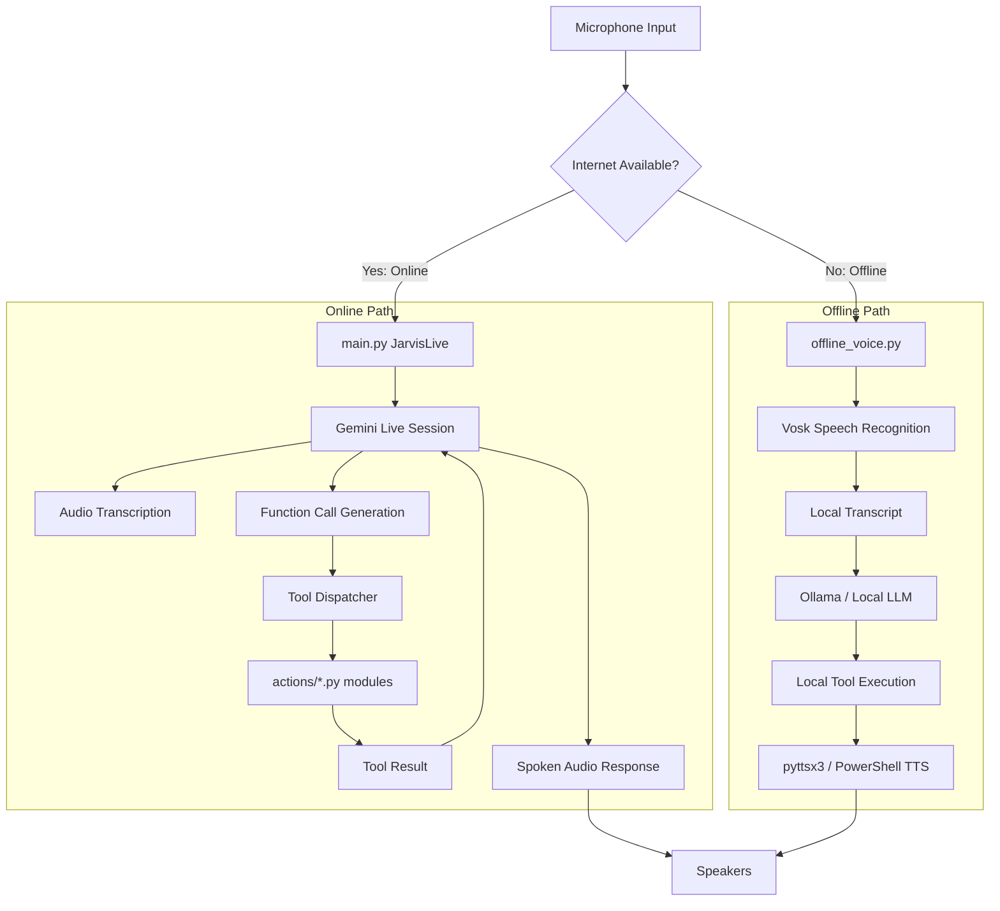

# J.A.R.V.I.S — Architecture Document v1.0

A comprehensive technical reference for the internal design, data flow, and component interaction of the JARVIS voice assistant.

---

## 1. High-Level Overview

JARVIS is a **dual-mode** real-time AI assistant. It can run:

* **Online Mode** — connected to Google Gemini Live for ultra-low-latency speech-to-speech interaction, with automatic function calling.
* **Offline Mode** — fully local, using Vosk for speech recognition and Ollama (or another local LLM) for text generation.

Both modes share a common **tool execution layer**, a persistent **memory system**, and a **PyQt6-based HUD** that displays system metrics, conversation logs, and file drop-zone capabilities.

The central orchestrator is `main.py`. It decides which mode to activate based on internet connectivity and then either connects to Gemini Live or falls back to the offline voice assistant.

---

## 2. Core Data Flow (Voice → Response)



### Online Path Details

1. **Microphone** → `sounddevice` captures 16 kHz, 16-bit mono audio.
2. **`JarvisLive._listen_audio()`** streams audio chunks into the Gemini Live session.
3. **`JarvisLive._receive_audio()`** listens for server events:

   * Audio data → placed in `audio_in_queue` for playback.
   * Transcription events → logged and shown in UI.
   * Tool calls → dispatched to `JarvisLive._execute_tool()`.
4. **Tool execution** runs in a thread pool to avoid blocking the async loop. The result is sent back to Gemini, which may continue the conversation or generate a final spoken response.
5. After a turn completes, the input/output text is passed to the **memory pipeline** to extract and persist important facts.

### Offline Path Details

1. `offline_voice.py` starts a Vosk recognizer on the microphone.
2. Transcribed text is sent to Ollama (via `llm_client.py`) with a restricted prompt that forbids internet-only tools.
3. The LLM's text response is spoken using `pyttsx3` (or a PowerShell fallback on Windows).
4. Local tool commands (e.g., `file_controller`, `computer_settings`) are executed synchronously in the same process.

---

## 3. Component Tree

```text
JARVIS/
├── main.py                    # Application entry point, JarvisLive orchestrator
├── ui.py                      # PyQt6 GUI: HUD, metrics, log, file drop, interrupt
├── offline_voice.py           # Offline speech recognition & local LLM loop
├── core/
│   └── prompt.txt             # System prompt for online mode
├── config/
│   ├── api_keys.json          # Gemini & OpenRouter keys, OS setting
│   └── llm_config.json        # Local LLM model & service configuration
├── actions/
│   ├── browser_control.py     # Playwright-based browser automation
│   ├── code_helper.py         # Code generation, explanation, execution
│   ├── computer_control.py    # Low-level mouse/keyboard, screen capture (mss)
│   ├── computer_settings.py   # Volume, brightness, window management
│   ├── desktop.py             # Wallpaper, organize, clean, stats
│   ├── dev_agent.py           # Multi-file project builder
│   ├── file_controller.py     # File CRUD, search, organize
│   ├── file_processor.py      # Document conversion, summarization, media processing
│   ├── flight_finder.py       # Google Flights search
│   ├── game_updater.py        # Steam/Epic game management
│   ├── open_app.py            # Application launcher
│   ├── reminder.py            # Windows Task Scheduler reminders
│   ├── screen_processor.py    # Screen/camera analysis via Gemini Vision
│   ├── send_message.py        # WhatsApp/Telegram messaging
│   ├── weather_report.py      # Weather lookup
│   ├── web_search.py          # DuckDuckGo + OpenRouter-powered search
│   └── youtube_video.py       # YouTube playback, summary, transcript
├── agent/
│   ├── executor.py            # Multi-step task executor with content injection
│   ├── planner.py             # LLM-based task decomposition
│   ├── task_queue.py          # Priority queue for background agent tasks
│   └── error_handler.py       # Error analysis and recovery strategies
├── memory/
│   ├── memory_manager.py      # Memory extraction, formatting, trimming
│   └── long_term.json         # Structured user profile
├── docs/
│   └── architecture.md        # This document
├── logs/
│   └── llm_errors.log         # LLM error dump
└── requirements.txt
```

---

## 4. Tool Execution Layer

All tools listed in `TOOL_DECLARATIONS` (inside `main.py`) are available to both the online model (via Gemini function calling) and the offline assistant (via a restricted local prompt).

When a tool is invoked:

* **Online:** `JarvisLive._execute_tool()` receives the function call, identifies the tool name, and dispatches to the appropriate module.
* **Offline:** `offline_voice.py` parses the LLM's JSON output and calls the same modules.

The tool modules return a short string result, which is:

* Spoken by the voice layer (online: Gemini; offline: TTS engine).
* Logged in the UI's activity log.

### Key Modules

#### `computer_settings.py`

* Volume: uses `nircmd.exe` for precise system-wide control.
* Brightness: uses `screen_brightness_control` + WMI fallback (laptops).
* Window management: uses `pygetwindow` to minimize/maximize/close by title.
* Screenshot: uses `mss` to capture and save to Desktop.
* Lock screen: direct `LockWorkStation()` Windows API call.

#### `browser_control.py`

* Auto-detects the default browser (Chrome, Brave, Opera, etc.).
* Launches Playwright connected to the real browser (not a separate instance).
* Full tab lifecycle: `new_tab`, `switch_tab`, `close_tab`, `list_tabs`.
* Scrolling: by pixel, full page (`PageDown`/`PageUp`), or into a specific selector.
* Form filling, smart click/type, page text extraction, reload.

#### `file_controller.py`

* Resolves shortcuts: `desktop`, `downloads`, `documents`, etc.
* All CRUD operations, plus `find` by name/extension, `disk_usage`, `organize_desktop`.

#### `file_processor.py`

* **TXT → PDF** via `fpdf2` (zero dependencies).
* **DOCX → PDF** via `docx2pdf` (requires Word).
* Image resize/compress/convert via Pillow.
* PDF/DOCX/TXT summarization, analysis, translation via Gemini.
* Audio/video transcription and processing (requires `pydub`/`ffmpeg`).

#### `agent/executor.py`

* Runs background tasks submitted by the `agent_task` tool.
* Uses `planner.py` to create a step-by-step plan (`web_search → file_controller → ...`).
* **Content Injection:** automatically fills the final write step with the results of previous web searches, so the user never gets a placeholder.
* Error recovery: up to 3 retries, with intelligent replanning on failure.

---

## 5. Memory System

The memory system stores a structured user profile in `memory/long_term.json`. It uses the following categories:

| Category        | Example Keys                      |
| --------------- | --------------------------------- |
| `identity`      | name, age, job, city              |
| `preferences`   | favorite_food, preferred_language |
| `projects`      | active_project, current_goal      |
| `relationships` | sister_name, partner_name         |
| `wishes`        | dream_travel, wishlist            |
| `notes`         | anything else worth remembering   |

### Flow

1. After each conversation turn, the user's input and JARVIS's output are sent to `should_extract_memory()`.
2. If important facts are detected, `extract_memory()` calls Gemini to produce a structured update.
3. `update_memory()` merges the new facts into the JSON file and trims the store if it exceeds a size limit.
4. On startup, the memory is loaded and formatted as a block of text appended to the system prompt, so JARVIS remembers the user.

---

## 6. Interrupt / Resume System

A dedicated **⏹ STOP** button in the right panel allows the user to instantly halt JARVIS's speech and processing.

### Implementation

* `ui.py` → `_interrupt_flag` (a `threading.Event`) is created once in `MainWindow.__init__`.
* **STOP:** sets the flag.
* **RESUME:** clears the flag.
* `main.py`:

  * `_play_audio()` drains the audio queue and waits until the flag is cleared.
  * `_receive_audio()` skips processing while the flag is set, keeping the Gemini session alive.
* The button toggles between red **STOP** and green **RESUME** states.

This design keeps the WebSocket connection intact, so no reconnection is needed after resume.

---

## 7. Heartbeat & Session Keep-Alive

To prevent the Gemini Live session from timing out during long periods of silence, a **heartbeat task** sends a silent text message every 45 seconds:

```python
async def _heartbeat():
    while True:
        await asyncio.sleep(45)
        try:
            await session.send_client_content(
                turns={"parts": [{"text": "."}], "turn_complete": True}
            )
        except Exception:
            break
```

This ensures the assistant remains responsive even after extended idle periods.

---

## 8. UI (HUD) Architecture

`ui.py` is a PyQt6 application with the following components:

* **HudCanvas:** animated, real-time visual feedback with concentric arcs, particles, and a face icon.
* **MetricBar:** live CPU, memory, network, GPU, and temperature gauges.
* **LogWidget:** animated typewriter-style activity log (instant display for messages longer than 200 characters).
* **FileDropZone:** drag-and-drop file upload with automatic type detection.
* **Interrupt Button:** toggle stop/resume with visual state change.
* **Mute Button:** toggles microphone on/off with F4 shortcut.
* **Fullscreen Button:** F11 toggle.
* **Command Input:** text input field with send button.

All state changes (speaking, listening, thinking, muted) are communicated via Qt signals, ensuring thread-safe UI updates from the async voice threads.

---

## 9. Error Handling & Logging

* **Online:** Unhandled exceptions in the Gemini session trigger a reconnection loop (with a 3-second delay).
* **Offline:** Errors are logged and the assistant attempts to continue.
* **Agent tasks:** `error_handler.py` analyzes failures and can choose to retry, skip, abort, or generate a corrected step.
* **File logging:** LLM errors are written to `logs/llm_errors.log`.
* **Console output:** Extensive print statements with `[JARVIS]`, `[Executor]`, `[Planner]`, `[FileProcessor]` prefixes for debugging.

---

## 10. Security & Privacy Considerations

* API keys are stored locally in `config/api_keys.json`. **Do not commit this file to public repositories.**
* Offline mode uses no internet and keeps all data local.
* File operations are restricted to the user's home directory by default.
* No data is sent to external servers except for explicit API calls to Gemini, OpenRouter, and the web search provider.
* Future roadmap includes encrypted memory and a permission system for dangerous operations.

---

*Architecture document maintained by Abazar Adam — v1.0, August 2026.*
