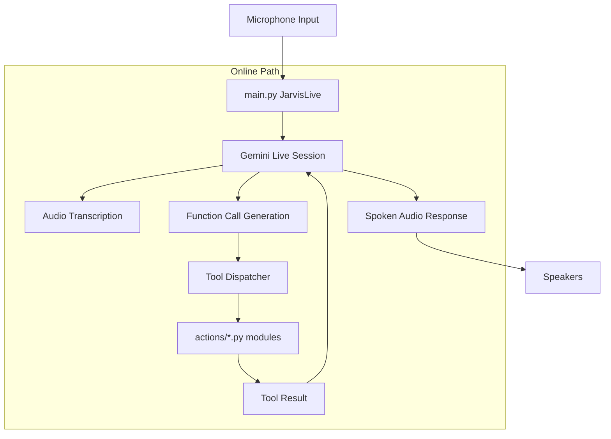

# J.A.R.V.I.S — Architecture Document v1.0

A comprehensive technical reference for the internal design, data flow, and component interaction of the JARVIS voice assistant.

---

## 1. High-Level Overview

JARVIS is a **real-time AI assistant** with:

* **Online Mode** – connected to Google Gemini Live for ultra-low-latency speech-to-speech interaction and automatic function calling.
* **Optional Offline Mode** – local speech recognition and local LLM integration (present in code, not active in current builds).

Both modes share a common **tool execution layer**, a persistent **memory system**, and a **PyQt6-based HUD** that displays system metrics, conversation logs, and file drop-zone capabilities.

The central orchestrator is `main.py`. It decides which mode to activate based on internet connectivity and then either connects to Gemini Live or falls back to the offline voice assistant.

---

## 2. Core Data Flow (Voice → Response)



### Online Path Details

1. **Microphone** → `sounddevice` captures 16 kHz, 16-bit mono audio.
2. **`JarvisLive._listen_audio()`** streams audio chunks into the Gemini Live session.
3. **`JarvisLive._receive_audio()`** listens for server events:

   * Audio data → placed in `audio_in_queue` for playback.
   * Transcription events → logged and shown in UI.
   * Tool calls → dispatched to `JarvisLive._execute_tool()`.
4. **Tool execution** runs in a cancellable thread pool. The result is sent back to Gemini, which may continue the conversation or generate a final spoken response.
5. After a turn completes, the input/output text is passed to the **memory pipeline** to extract and persist important facts.

---

## 3. Component Tree

```text
JARVIS/
├── main.py
├── ui.py
├── server.py
├── core/
├── config/
├── actions/
├── agent/
├── memory/
├── plugins/
├── tools/
├── docs/
├── logs/
└── requirements.txt
```

---

## 4. Tool Execution Layer

All tools listed in `TOOL_DECLARATIONS` (inside `main.py`) are available to the online model via Gemini function calling. Plugins are added at runtime to `PLUGIN_DECLARATIONS`.

When a tool is invoked:

* **Online:** `JarvisLive._execute_tool()` receives the function call, identifies the tool name, and dispatches to the appropriate module.
* **Plugins:** Dispatched through `PLUGIN_FUNCTIONS` after being auto-loaded from `plugins/`.

The tool modules return a short string result, which is spoken by the voice layer and logged in the UI.

### Key Modules

#### `computer_settings.py`

* Volume control via `nircmd.exe`
* Brightness via WMI
* Window management via `pygetwindow`
* Screenshots via `mss`
* Lock screen via Windows API

#### `browser_control.py`

* Default browser detection
* Playwright automation
* Tab management
* Scrolling and form automation
* Page text extraction

#### `cyber_recon.py`

* OSINT and subdomain enumeration
* Breach checks
* Nmap and Nikto scanning
* SSL analysis
* PDF reporting

#### `screen_processor.py`

* Screen and webcam analysis
* Continuous streaming
* Immediate STOP support

#### `file_controller.py`

* File CRUD operations
* Search and organization
* Disk usage analysis

#### `file_processor.py`

* TXT → PDF
* DOCX → PDF
* Image processing
* Document summarization
* Media transcription

#### `agent/executor.py`

* Multi-step task execution
* Content injection between steps
* Retry and replanning support

---

## 5. Memory System

Structured user data is stored in `memory/long_term.json`.

| Category      | Examples            |
| ------------- | ------------------- |
| identity      | name, age, job      |
| preferences   | language, food      |
| projects      | current project     |
| relationships | family names        |
| wishes        | goals, travel plans |
| notes         | miscellaneous       |

Memory is extracted after conversations, merged into the JSON file, and injected into the system prompt on startup.

---

## 6. Interrupt / Resume System

A global **STOP** button halts speech, tool execution, and agent tasks.

* STOP sets a shared interrupt flag.
* RESUME clears it.
* Running tasks check the flag and terminate safely.

---

## 7. Remote Dashboard

Flask-based dashboard with optional ngrok tunnel.

* Password protection
* QR code pairing
* Voice input from phone
* Remote command execution

---

## 8. Plugin Architecture

Each plugin defines:

```python
PLUGIN_INFO = {
    "name": "plugin_name",
    "description": "...",
    "parameters": {}
}

def execute(parameters, player=None, speak=None) -> str:
    return "result"
```

Plugins are auto-loaded from `plugins/`.

---

## 9. Heartbeat & Session Keep-Alive

A heartbeat message is sent every 45 seconds to keep the Gemini Live session alive during silence.

---

## 10. Error Handling & Logging

* Session reconnection on failures
* Global crash logging
* Agent retry and replanning
* LLM error logging

---

## 11. Security & Privacy

* API keys remain local.
* Remote access is disabled unless explicitly enabled.
* File operations are limited to the user environment by default.
* External communication occurs only for configured APIs and web requests.

---

*Architecture document maintained by Abazar Adam — v1.0, August 2026.*
