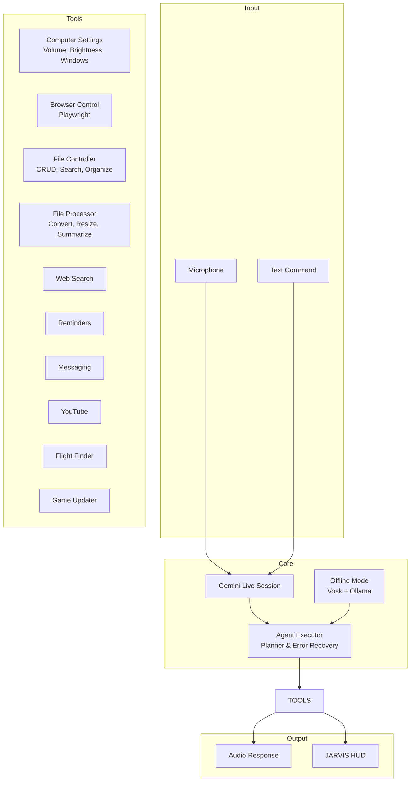

# J.A.R.V.I.S – Just A Rather Very Intelligent System v1.0

*A real-time, voice-first AI assistant for Windows. Control your computer, automate complex workflows, and stay productive — all through natural conversation.*


---

## 🧠 Architecture Overview



JARVIS runs in two modes:

* **Online** — ultra-low-latency voice conversation via Google Gemini Live, with automatic tool calling.
* **Offline** — local speech recognition (Vosk) + local LLM (Ollama) for tasks that do not require the internet.

The agent executor uses an LLM-powered planner to break complex goals into tool steps, with built-in error recovery and retry logic.

---

## ⚡ Core Capabilities

### 🖥️ System Control

* **Volume** — set precise levels using `nircmd`.
* **Brightness** — adjust via WMI (laptops only).
* **Window Management** — minimize, maximize, or close any app by its title.
* **Lock / Restart / Shutdown** — direct Windows API calls.
* **Screenshots** — capture full screen and save to your Desktop.

### 🌐 Browser Automation (Playwright)

* Open any website in your default browser.
* Search Google, Bing, or DuckDuckGo.
* Manage tabs: **new, switch, close, list**.
* Scroll by pixel, full page, or to specific elements.
* Fill forms, click elements, and extract page text.

### 📁 File Operations

* Create, read, write, move, copy, rename, delete files.
* **Organize Desktop** by file type.
* **Search** by name or extension.
* **Disk usage** and large-file scanner.

### 🔄 File Processing

* Convert **TXT → PDF** (pure Python, no Word required).
* Convert **DOCX → PDF** (requires Microsoft Word).
* Resize, compress, and convert images (PNG, JPG, WebP, BMP, TIFF).
* Summarize PDFs, Word docs, and text files using Gemini.
* Transcribe audio and video files.
* Analyze CSV / Excel datasets.

### 🧩 Multi-Step Agent

Give JARVIS a complex goal, for example:

> “Research the health benefits of green tea and save a summary to my desktop.”

The planner automatically breaks it into steps: **web search → collect results → write file**.

Error recovery and automatic replanning keep tasks robust.

### 🧠 Long-Term Memory

* JARVIS remembers facts about you (identity, preferences, projects) across sessions.
* Stored in `memory/long_term.json`.

### ⏹ Interrupt / Resume

* A dedicated **STOP** button in the UI instantly halts speech and processing.
* Click **RESUME** to continue — no reconnect loops and no dropped audio.

---

## 📋 Quick Start

### 1. Clone the repository

```bash
git clone https://github.com/AbazarAdam/jarvis.git
cd jarvis
```

### 2. Create a virtual environment (recommended)

```bash
python -m venv .venv
.venv\Scripts\activate
```

### 3. Install dependencies

```bash
pip install -r requirements.txt
playwright install
```

### 4. Set up API keys

Create `config/api_keys.json` with your [Gemini](https://aistudio.google.com/apikey) and [OpenRouter](https://openrouter.ai/) keys:

```json
{
  "gemini_api_key": "AIza...",
  "openrouter_api_key": "sk-or-...",
  "os_system": "windows"
}
```

### 5. Launch JARVIS

```bash
python main.py
```

---

## 🔮 Roadmap (v1.1+)

### 🛡️ Cybersecurity & Engineering Features

* [ ] **Sandboxed Code Execution** — run generated scripts in isolated containers.
* [ ] **Encrypted Memory Store** — AES-256 encryption for `long_term.json`.
* [ ] **Permission Manager** — confirm dangerous actions (shutdown, file deletions) with voice or GUI.
* [ ] **Audit Log** — timestamped record of every tool invocation for forensic analysis.
* [ ] **Voice-Activated Security Tools** — integrate Nmap, Wireshark, and Metasploit (read-only for safety).
* [ ] **Automated Security Reports** — scan a network and generate a PDF report.

### 🤖 AI & Productivity

* [ ] **Wake Word** — “Jarvis” always-listening mode.
* [ ] **Conversation Context** — remember entire conversation history, not just facts.
* [ ] **Proactive Assistance** — suggest actions based on time, idle state, or detected events.
* [ ] **Multi-Language Support** — seamless translation of voice commands and tool outputs.

### 🔧 Engineering Excellence

* [ ] **Unit Tests & CI/CD** — full test coverage for all action modules.
* [ ] **Plugin Architecture** — add custom tools without modifying the core.
* [ ] **Docker Deployment** — one-command setup on any platform.
* [ ] **Remote Web Dashboard** — control JARVIS from your phone or tablet.

---

## 👤 Author

**Abazar Adam**
Cybersecurity Engineer & Software Engineer

---

## 📄 License

Personal and non-commercial use only — [Creative Commons BY-NC 4.0](https://creativecommons.org/licenses/by-nc/4.0/).

---

*Made with ❤️, Python, and far too much caffeine.*
