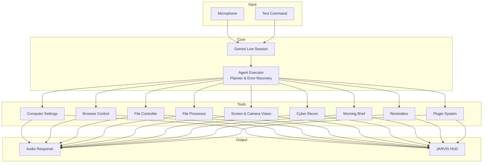

# J.A.R.V.I.S – Just A Rather Very Intelligent System v1.0

*A real-time, voice-first AI assistant for Windows. Control your computer, automate complex workflows, and stay productive — all through natural conversation.*


---

## 🧠 Architecture Overview



---

## ⚡ Core Capabilities

### 🖥️ System Control

* **Volume** — precise levels via `nircmd.exe`
* **Brightness** — WMI-based, works on laptops
* **Window management** — minimize, maximize, and close apps by title
* **Lock / Restart / Shutdown** — direct Windows API calls
* **Screenshots** — capture the full screen and save it to the Desktop

### 🌐 Browser Automation (Playwright)

* Open any website in your default browser
* Search Google, Bing, or DuckDuckGo
* Manage tabs: new, switch, close, list
* Scroll by pixel, full page, or to specific elements
* Fill forms, click elements, extract page text, and reload pages

### 📁 File Operations

* Create, read, write, move, copy, rename, and delete files
* Organize the Desktop by file type
* Search by name or extension
* Disk usage and large-file scanner

### 🔄 File Processing

* Convert **TXT → PDF** (pure Python)
* Convert **DOCX → PDF** (requires Microsoft Word)
* Resize, compress, and convert images
* Summarize PDFs, Word documents, and text files with Gemini
* Transcribe audio and video files
* Analyze CSV and Excel datasets

### 🧩 Multi-Step Agent

Give JARVIS a complex goal, and the planner automatically breaks it into steps such as:

* Web search → Collect results → Write file
* Error recovery and automatic replanning

### 🧠 Long-Term Memory

JARVIS stores a structured user profile in `memory/long_term.json` and remembers important facts across sessions.

### 📷 Camera Vision & Streaming

* Single snapshot analysis (screen or webcam)
* Continuous camera streaming with real-time observations
* Instant interruption via the **STOP** button

### 🛡️ Cyber Recon & Pentest

Unified cybersecurity toolkit including:

* Subdomain enumeration (crt.sh)
* Email harvesting and breach checking
* LinkedIn / employee discovery
* Nmap port scanning with CVE scripts
* Nikto web vulnerability scanning
* SSL/TLS certificate analysis
* Professional PDF reporting

### 📡 Remote Dashboard

* Password-protected web dashboard
* Type or speak commands from any phone
* QR code pairing
* Automatic ngrok shutdown on disconnect

### ☀️ Morning Brief

* Cybersecurity news
* AI & software engineering news
* Unread email summary
* Spoken overview + full report saved to Desktop

### 🧩 Plugin Architecture

Drop Python plugins into the `plugins/` folder and JARVIS will auto-load them at startup — no core code changes required.

---

## 📋 Prerequisites

### Core Features

* Windows 10 / 11
* Python 3.11+
* Gemini API key
* OpenRouter API key

### Cyber Recon (`cyber_recon`)

Install the following external tools:

* **Nmap:** https://nmap.org/download.html
* **Strawberry Perl:** https://strawberryperl.com/
* **Nikto:** clone into `tools/nikto`

```bash
git clone https://github.com/sullo/nikto tools/nikto
```

---

## 📦 Quick Start

### 1. Clone the Repository

```bash
git clone https://github.com/AbazarAdam/jarvis.git
cd jarvis
```

### 2. Create a Virtual Environment

```bash
python -m venv .venv
.venv\Scripts\activate
```

### 3. Install Dependencies

```bash
pip install -r requirements.txt
playwright install
```

### 4. Configure API Keys

Create `config/api_keys.json`:

```json
{
  "gemini_api_key": "AIza...",
  "openrouter_api_key": "sk-or-...",
  "os_system": "windows",
  "remote_password": "your-secret-password"
}
```

### 5. Launch JARVIS

```bash
python main.py
```

---

## 🔮 Roadmap

### 🛡️ Cybersecurity & Engineering

* [x] Unified cyber recon (OSINT + Nmap + Nikto)
* [ ] Nuclei / deeper CVE scanning
* [ ] Encrypted memory store
* [ ] Permission manager
* [ ] Social engineering OSINT expansion

### 🤖 AI & Productivity

* [x] Morning brief
* [x] Camera vision & streaming
* [x] Remote voice dashboard
* [ ] Wake word “Jarvis”
* [ ] Conversation context memory
* [ ] Proactive assistance
* [ ] Dark / light mode

### 🔧 Engineering Excellence

* [x] Unit tests & CI/CD
* [x] Docker build job
* [x] Plugin architecture
* [ ] Full Dockerized JARVIS
* [ ] Code coverage service (Codecov)
* [ ] Linting and type checking

---

## 👤 Author

**Abazar Adam**
Cybersecurity Engineer & Software Engineer

---

## 📄 License

Personal and non-commercial use only — [Creative Commons BY-NC 4.0](https://creativecommons.org/licenses/by-nc/4.0/)

---

*Made with ❤️, Python, and far too much caffeine.*
