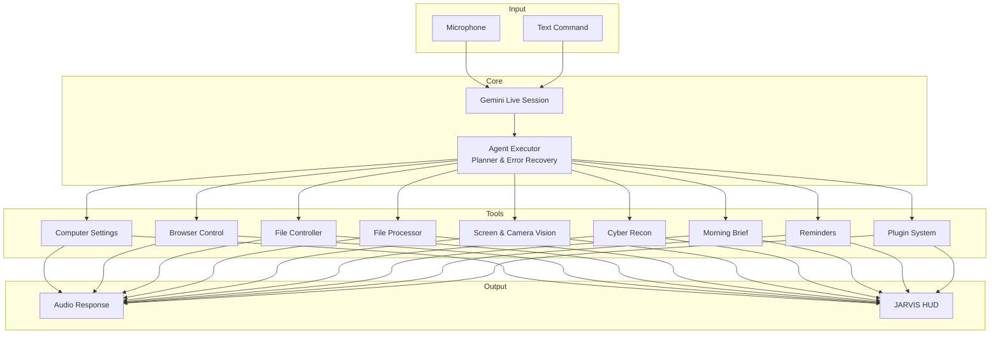

# J.A.R.V.I.S – Just A Rather Very Intelligent System v1.1

*A real-time, voice-first AI assistant for Windows. Control your computer, automate complex workflows, and stay productive — all through natural conversation.*


---

## 🧠 Architecture Overview



---

## 🧠 Self‑Learning Cortex

JARVIS v1.1 introduces a brain layer that enables:

- Goal interpretation and tool conflict resolution
- Safety-gated execution
- Safe code sandboxing
- Cloud model routing with automatic fallback
- Learned skill creation, validation, storage, and execution
- Real red-team attack-chain correlation

| Module | Role |
|---|---|
| `core/cortex.py` | Goal interpreter + capability selector |
| `core/safety.py` | Filesystem/command/risk safety boundary |
| `core/sandbox.py` | Safe generated-code execution |
| `core/execution_guard.py` | Pre-execution gate for all tools |
| `core/model_router.py` | Central cloud model orchestrator |
| `core/skill_store.py` | Persistent de-duplicated skill storage |
| `core/skill_validator.py` | Skill validation and execution |
| `core/skill_synthesizer.py` | Autonomous skill creation |
| `plugins/skill_runner.py` | Exposes learned skills to JARVIS |
| `actions/attack_chain.py` | CVE correlation and attack-path reasoning |

---

## ⚡ Core Capabilities

### 🖥️ System Control

* **Volume** — precise levels via `nircmd.exe`
* **Brightness** — WMI-based, works on laptops
* **Window management** — minimize, maximize, and close apps by title
* **Lock / Restart / Shutdown** — direct Windows API calls
* **Screenshots** — capture the full screen and save it to the Desktop

### 🌐 Browser Automation (Playwright)

* Open any website in a dedicated JARVIS Chrome profile
* Search DuckDuckGo by default, with Google/Bing support
* Detect Google CAPTCHA and fall back automatically to DuckDuckGo
* Manage tabs: new, switch, close, list
* Scroll by pixel, full page, or to specific elements
* Fill forms, click elements, extract page text, and reload pages

### 📁 File Operations

* Create, read, write, move, copy, rename, and delete files
* Organize the Desktop by file type
* Search by name or extension
* Disk usage and large-file scanner

### 🔄 File Processing

* Convert **TXT → PDF** (pure Python)
* Convert **DOCX → PDF** (requires Microsoft Word)
* Resize, compress, and convert images
* Summarize PDFs, Word documents, and text files with Gemini
* Transcribe audio and video files
* Analyze CSV and Excel datasets

### 🧩 Multi-Step Agent

Give JARVIS a complex goal, and the planner automatically breaks it into steps such as:

* Web search → Collect results → Write file
* Error recovery and automatic replanning

### 🧠 Self-Learning & Safety

JARVIS can now learn new skills by itself, validate them safely, and reuse them later.

* Generates new Python skills from natural language
* Tests generated code inside a restricted sandbox
* Promotes only proven successful skills
* De-duplicates similar skills automatically
* Enforces filesystem and command safety boundaries
* Routes LLM calls across providers with fallback and cooldown

### 🧠 Long-Term Memory

JARVIS stores a structured user profile in `memory/long_term.json` and remembers important facts across sessions.

### 📷 Camera Vision & Streaming

* Single snapshot analysis (screen or webcam)
* Continuous camera streaming with real-time observations
* Instant interruption via the **STOP** button

### 🛡️ Cyber Recon & Pentest

Unified cybersecurity toolkit including:

* Subdomain enumeration via crt.sh, Subfinder, Amass, Sublist3r
* Live URL probing with httpx, DNS resolution with dnsx, crawling with katana
* Hidden parameter discovery with Arjun, WAF detection with wafw00f
* Directory brute-force with Gobuster, ffuf, dirsearch
* CVE scanning with Nuclei, web scanning with Nikto
* SQL injection with sqlmap, XSS with dalfox/XSStrike, CMS scans with Droopescan/WPScan
* SSL/TLS certificate analysis, OSINT dorks, AI tactical insight
* Professional PDF report with severity classification

### 📡 Remote Dashboard

* Password-protected web dashboard
* Type or speak commands from any phone
* QR code pairing
* Automatic ngrok shutdown on disconnect

### ☀️ Morning Brief

* Real-time cybersecurity news from RSS feeds
* Real-time AI & software engineering news from RSS feeds
* Unread email summary
* Spoken overview + full report saved to Desktop

### 🧩 Plugin Architecture

Drop Python plugins into the `plugins/` folder and JARVIS will auto-load them at startup — no core code changes required.

---

## 📋 Prerequisites

### Core Features

* Windows 10 / 11
* Python 3.11+
* Gemini API key
* OpenRouter API key

### Cyber Recon (`cyber_recon`)

Install the following external tools:

* **Nmap:** https://nmap.org/download.html
* **Strawberry Perl:** https://strawberryperl.com/
* **Nikto:** clone into `tools/nikto`

```bash
git clone https://github.com/sullo/nikto tools/nikto
```

---

---

## 📁 Project Structure

```text
JARVIS/
├── main.py                    # Main orchestrator, JarvisLive class, tools
├── ui.py                      # PyQt6 GUI
├── server.py                  # Flask remote dashboard + ngrok
├── core/
│   ├── prompt.txt             # System prompt
│   ├── error_handler.py       # Global crash recovery
│   ├── audit.py               # Audit logging
│   ├── proactive.py           # Proactive assistance engine
│   ├── self_heal.py           # Self‑healing system
│   ├── proxy_manager.py       # Proxy configuration
│   ├── safety.py              # Safety boundary
│   ├── sandbox.py             # Safe code execution
│   ├── cortex.py              # Goal interpreter / conflict resolver
│   ├── execution_guard.py     # Pre-execution gate
│   ├── model_router.py        # Cloud LLM router
│   ├── skill_store.py         # Skill persistence
│   ├── skill_validator.py     # Skill validation
│   └── skill_synthesizer.py   # Autonomous skill creation
├── actions/
│   ├── security_mode.py       # Red-team pentest engine
│   ├── attack_chain.py        # CVE correlation & attack paths
│   ├── code_helper.py         # Code helper
│   ├── dev_agent.py           # Full project builder
│   ├── reminder.py            # Persistent reminders
│   ├── browser_control.py     # Playwright browser automation
│   ├── file_controller.py     # File CRUD
│   ├── file_processor.py      # Document conversion/summarisation
│   ├── computer_settings.py   # Volume, brightness, windows
│   ├── computer_control.py    # Mouse/keyboard/screenshot
│   └── morning_brief.py       # Morning news + emails
├── plugins/
│   ├── security_tool_manager.py
│   ├── git_plugin.py
│   ├── email_plugin.py
│   ├── system_management.py
│   ├── learning_mode.py
│   ├── tell_time.py
│   ├── news_plugin.py
│   └── skill_runner.py
├── agent/
│   ├── executor.py
│   ├── planner.py
│   ├── task_queue.py
│   └── error_handler.py
├── memory/
│   ├── memory_manager.py
│   ├── long_term.json
│   ├── skills/
│   └── shortcuts.json
├── tools/                     # External security tools
├── tests/
├── docs/
├── requirements.txt
└── Dockerfile
---

## 📦 Quick Start

### 1. Clone the Repository

```bash
git clone https://github.com/AbazarAdam/jarvis.git
cd jarvis
```

### 2. Create a Virtual Environment

```bash
python -m venv .venv
.venv\Scripts\activate
```

### 3. Install Dependencies

```bash
pip install -r requirements.txt
playwright install
```

### 4. Configure API Keys

Create `config/api_keys.json`:

```json
{
  "gemini_api_key": "AIza...",
  "openrouter_api_key": "sk-or-...",
  "os_system": "windows",
  "remote_password": "your-secret-password"
}
```

### 5. Launch JARVIS

```bash
python main.py
```

---

## 🔮 Roadmap

### 🛡️ Cybersecurity & Engineering

* [x] Unified cyber recon (OSINT + Nmap + Nikto)
* [x] Nuclei / deeper CVE scanning
* [x] Permission manager
* [x] Proxy support for security tools
* [x] Exploitation logic (sqlmap, dalfox/XSStrike, WAF bypass)
* [x] Severity-classified PDF reports
* [ ] Encrypted memory store
* [ ] Social engineering OSINT expansion

### 🤖 AI & Productivity

* [x] Morning brief
* [x] Real-time news plugin using RSS
* [x] Camera vision & streaming
* [x] Remote voice dashboard
* [x] Proactive assistance
* [x] STOP button hard reset + background task cancellation
* [ ] Wake word “Jarvis”
* [ ] Conversation context memory
* [ ] Dark / light mode

### 🔧 Engineering Excellence

* [x] Unit tests & CI/CD
* [x] Docker build job
* [x] Plugin architecture
* [x] Background task cancellation
* [ ] Full Dockerized JARVIS
* [ ] Linting and type checking

---

## 👤 Author

**Abazar Adam**
Cybersecurity Engineer & Software Engineer

---

## 📄 License

Personal and non-commercial use only — [Creative Commons BY-NC 4.0](https://creativecommons.org/licenses/by-nc/4.0/)

---

*Made with ❤️, Python, and far too much caffeine.*
