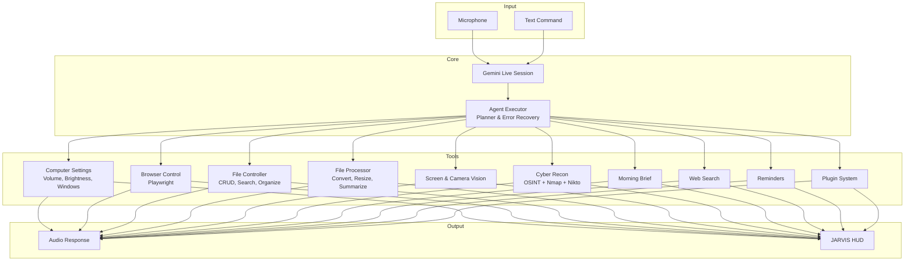

# J.A.R.V.I.S – Just A Rather Very Intelligent System v1.0

*A real-time, voice-first AI assistant for Windows. Control your computer, automate complex workflows, and stay productive — all through natural conversation.*


---

## 🧠 Architecture Overview



---

## ⚡ Core Capabilities

### 🖥️ System Control

* **Volume** – precise levels via `nircmd.exe`
* **Brightness** – WMI-based, works on laptops
* **Window Management** – minimize, maximize, close any app by title
* **Lock / Restart / Shutdown** – direct Windows API calls
* **Screenshots** – capture full screen and save to Desktop

### 🌐 Browser Automation (Playwright)

* Open any website in your default browser
* Search Google, Bing, or DuckDuckGo
* Manage tabs: new, switch, close, list
* Scroll by pixel, full page, or to specific elements
* Fill forms, click elements, extract page text, reload

### 📁 File Operations

* Create, read, write, move, copy, rename, delete files
* Organize Desktop by file type
* Search by name or extension
* Disk usage and large-file scanner

### 🔄 File Processing

* Convert TXT → PDF (pure Python, no Word required)
* Convert DOCX → PDF (requires Microsoft Word)
* Resize, compress, and convert images (PNG, JPG, WebP, BMP, TIFF)
* Summarize PDFs, Word docs, and text files using Gemini
* Transcribe audio and video files
* Analyze CSV / Excel datasets

### 🧩 Multi-Step Agent

Give JARVIS a complex goal, for example:

> “Research the health benefits of green tea and save a summary to my desktop.”

The planner automatically breaks it into steps: **web search → collect results → write file** with error recovery and automatic replanning.

### 🧠 Long-Term Memory

JARVIS remembers facts about you (identity, preferences, projects) across sessions in `memory/long_term.json`.

### 📷 Camera Vision & Streaming

* Single snapshot analysis (screen or webcam)
* Continuous camera streaming with real-time observations
* STOP button interrupts immediately

### 🛡️ Cyber Recon & Pentest

Unified cybersecurity tool that runs:

* Subdomain enumeration (crt.sh)
* Email harvesting & breach checking (Have I Been Pwned)
* LinkedIn/employee discovery
* Nmap port scanning with CVE vulnerability scripts
* Nikto web vulnerability scanning
* SSL/TLS certificate analysis
* Generates a professional PDF report

### 📡 Remote Dashboard

* Password-protected web dashboard
* Type or speak commands from any phone
* QR code pairing
* Force-kill ngrok on disconnect

### ☀️ Morning Brief

* Fetches cybersecurity news, AI/software engineering news, and unread emails
* Speaks a concise summary and saves a full report to Desktop

### 🧩 Plugin Architecture

Drop Python plugins into `plugins/` and JARVIS auto-loads them at startup. No core code changes needed.

---

## 📋 Quick Start

### 1. Clone the repository

```bash
git clone https://github.com/AbazarAdam/jarvis.git
cd jarvis
```

### 2. Create a virtual environment (recommended)

```bash
python -m venv .venv
.venv\Scripts\activate
```

### 3. Install dependencies

```bash
pip install -r requirements.txt
playwright install
```

### 4. Set up API keys

Create `config/api_keys.json` with your Gemini and OpenRouter keys:

```json
{
  "gemini_api_key": "AIza...",
  "openrouter_api_key": "sk-or-...",
  "os_system": "windows",
  "remote_password": "your-secret-password"
}
```

### 5. Launch JARVIS

```bash
python main.py
```

---

## 🔮 Roadmap (v1.1+)

### 🛡️ Cybersecurity & Engineering

* [ ] Nuclei / deeper CVE scanning
* [ ] Encrypted memory store
* [ ] Permission manager for dangerous actions
* [ ] Automated audit log
* [ ] Social engineering OSINT expansion

### 🤖 AI & Productivity

* [ ] Wake word “Jarvis”
* [ ] Conversation context memory (full history)
* [ ] Proactive assistance
* [ ] Dark/light mode

### 🔧 Engineering Excellence

* [ ] Docker deployment
* [ ] Unit tests & CI/CD
* [ ] More plugin examples

---

## 👤 Author

**Abazar Adam**
Cybersecurity Engineer & Software Engineer

---

## 📄 License

Personal and non-commercial use only – Creative Commons BY-NC 4.0

---

*Made with ❤️, Python, and far too much caffeine.*
